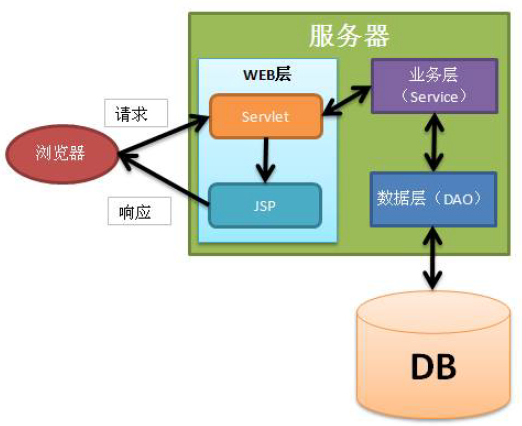

# javaweb_helloworld
最基本的Javaweb三层结构示例： DAO(数据层)， Service（业务层）, Servlet（web层）.
麻雀虽小、五脏俱全。数据和控制流（见下图）与正常JavaWeb一样。

### Note: How to start the project in tomcat
1. Make sure pom file has the <build> section of this project
2. Make sure this line `<packaging>war</packaging>` is added to the pom file.
3. Config the run in IntelliJ: 1) working directory: <project directory>; b) Command line: tomcat7:run; c) run maven goal: clean

